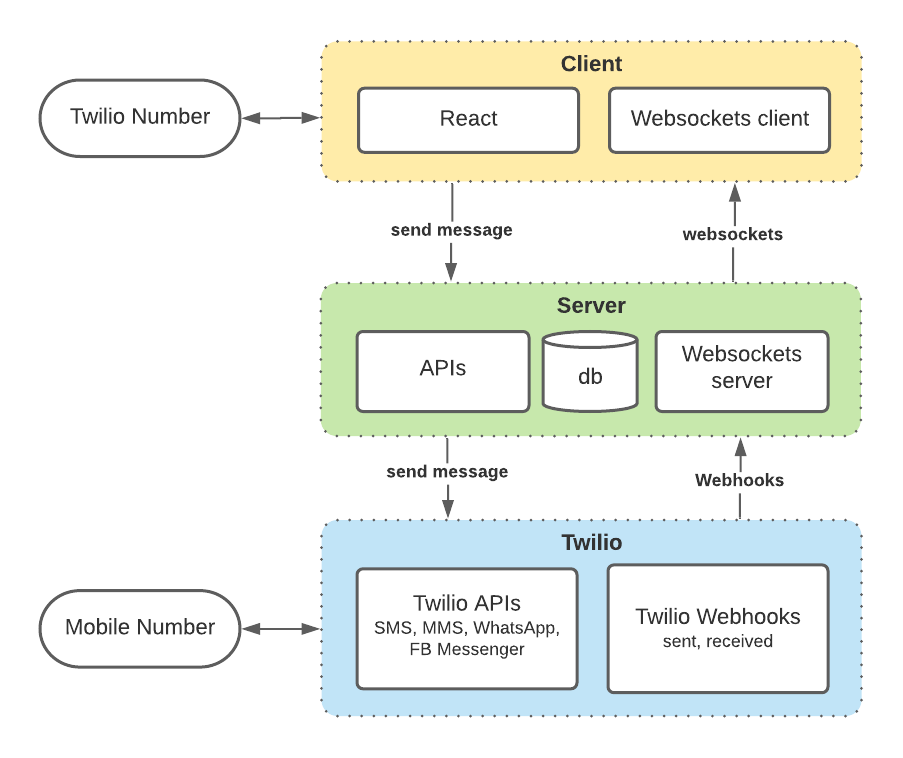

# Ziplio

## How it works

This app creates a Zipwhip-like interface for a Twilio phone number to send/receive text messages to/from a mobile phone. It uses the Twilio Programmable Messaging API to send messages via SMS, MMS, WhatsApp and Facebook Messenger; Twilio Webhooks for incoming/outgoing messages; and Websockets for pushing real-time updates to the clients from the server.

You can run locally or deploy to heroku.

## Features

- Web chat client is built in [React](https://reactjs.org/).
- Send and receive text messages (SMS & MMS) via [Twilio Programmable Messaging API](https://www.twilio.com/docs/sms/send-messages).
- Send and receive WhatsApp messages via [Twilio WhatsApp API](https://www.twilio.com/docs/whatsapp/api).
- Send and receive Facebook Messenger messages via [Twilio Channels API](https://www.twilio.com/docs/messaging/channels).
- Express server receives [Twilio Webhooks](https://www.twilio.com/docs/usage/webhooks/getting-started-twilio-webhooks) for incoming and outgoing messages.
- Messages are stored in Postgresql db.
- Each time the db is updated, the Server pushes updates to clients via [Websockets](https://npm.im/ws).
- One click [Deploy to Heroku](#deploy-to-heroku) button.

## Deploy to Heroku

As an alternative to configuring and running the app locally, you can quickly deploy it to heroku by clicking the button below. All that is required is a free Heroku account, plus a Twilio account and phone number.

[](https://heroku.com/deploy?template=https://github.com/johnchaffee/ziplio)

Note: When deploying to heroku, you will be prompted to enter the [environment variables described below](#env-variables). You should have these ready ahead of time.

## Architecture



## Requirements

- [Node.js](https://nodejs.org/)
- [Twilio account](https://twilio.com) and phone number
- [Postgresql](https://wiki.postgresql.org/wiki/Homebrew)

## Set up

1.  Clone this repository and `cd` into it

    ```bash
    git clone git@github.com:johnchaffee/ziplio.git
    cd ziplio
    ```

2.  Install dependencies
    
    The project includes two apps - a Node server app running on port 3001, and a React client app running on port 3000. You must install the dependencies for each seprately.

    To install the dependencies for the Node server, type the following in Terminal:

    ```bash
    npm install
    ```
    
    To install the dependencies for the React app, you must cd into the client directory then install its dependencies. Then cd back to the parent directory when done, by typing the following in Terminal

    ```bash
    cd client
    npm install
    cd ..
    ```

3.  <div id="env-variables"></div>Create a `.env` file in your root directory and enter the environment variables below.

    ```conf
    # LOCAL DEVELOPMENT ENV VARIABLES
    # Enter a port number (e.g. '3001') for local development
    PORT=3001
    # Enter 'development' for local development
    NODE_ENV=development
    # Enter 'localhost' for local development
    APP_HOST_NAME=localhost
    # Enter your ngrok endpoint URL for local development
    NGROK_URL=<unique_id>.ngrok.io

    # TWILIO ENVIRONMENT VARIABLES
    # Enter the following values available in Twilio Console
    TWILIO_NUMBER=<Your Twilio Phone Number, e.g. +12065551234>
    TWILIO_ACCOUNT_SID=<Your Twilio Account SID, e.g. AC0xxxxxxxxxx>
    TWILIO_AUTH_TOKEN=<Your Twilio Auth Token, e.g. 34axxxxxxxxxxx>
    WHATSAPP_ID=<Optional WhatsApp ID, e.g. whatsapp:+12065551234>
    FACEBOOK_MESSENGER_ID=<Optional Messenger ID, e.g. messenger:123456789012345>

    # HTTP BASIC AUTH ENVIRONMENT VARIABLES
    # Enter the username and password that will be required to access the app
    APP_USERNAME=<Your custom username>
    APP_PASSWORD=<Your custom password>

    # OPTIONAL VARIABLES
    # Number of conversations and messages returned from db. Defaults to 20. (optional)
    LIMIT=20
    ```

4.  Configure ngrok

    Your server needs to be accessible at a public internet address for Twilio Webhooks to send requests to it. You can do that using [ngrok](https://ngrok.com/) to create a tunnel to your local server.

    If you have ngrok installed, you can open a tunnel to your local server by running the following command:

    ```
    ngrok http 3001
    ```

    Now your application should be available at a url like:

    ```
    https://<unique_id>.ngrok.io/
    ```

    _Make sure you enter the URL above as the `NGROK_URL` envirnoment variable in the `.env` file as described in step 3._

5.  Configure [Twilio Webhooks](https://www.twilio.com/docs/usage/webhooks/getting-started-twilio-webhooks) for incoming messages on your Twilio Phone Number. You'll need to point it to the ngrok url above.

    You can do this in the Twilio Console > Phone Numbers > Manage > Active Numbers > PHONE_NUMBER. On the bottom of the page in the Messaging section where it says A MESSAGE COMES IN, select Webhook from the popup and enter your ngrok URL.

6.  Configure the database

    ## Data Model

    There are two database tables. One table stores a list of all the conversations that are displayed in the Conversations sidebar, and one that stores a list of all the inbound and outbound messages that are displayed in the Messages section.

    ### messages table

    The messages table stored all of the messages sent or received. It stores the `twilio_number` and `mobile_number` in the same column and indicates whether a message was `outbound` or `inbound` with the `direction` column. This allows you to fetch all inbound and outbound messages between a twilio number and mobile number with a single request.

    ```
     id | twilio_number | mobile_number |       date_created       | direction |            body                           media_url
    ----+---------------+---------------+--------------------------+------------------------------------------+--------------------------------
     53 | +18555080989  | +12065551212  | 2021-11-16T23:27:23.000Z | outbound  | hey, how's it going?         | https://demo.twilio.com/owl.png
     54 | +18555080989  | +12065551212  | 2021-11-16T23:27:34.000Z | inbound   | pretty good. how are you?    |
     55 | +18555080989  | +12065551212  | 2021-11-16T23:27:40.000Z | outbound  | I'm fine. Thanks for asking. |
    ```

    ```json
    [
      {
        "twilio_number": "+18555080989",
        "mobile_number": "+12065551212",
        "dateCreated": "2021-11-14T22:34:13.204Z",
        "direction": "outbound",
        "body": "hey, how's it going?",
        "media_url": "https://demo.twilio.com/owl.png"
      }
    ]
    ```

    ### conversations table

    The conversations table stores a list of unique conversations between a Twilio number and Mobile number pair. Each conversation has a status of open, closed or deleted; an unread count, and an optional name. The `conversations_id` is unique and created by combining the twilio number and mobile number separated by a semicolon.

    ```
     id |conversation_id            |       date_updated       |     name      | unread_count | status
    ----+---------------------------+--------------------------+---------------+--------------+-------
     53 | +18555080989;+12065551212 | 2021-11-16T23:27:23.000Z | Joe Smith     | 2            | open
     54 | +18555080989;+12063693826 | 2021-11-16T23:27:23.000Z | Sally Stevens | 0            | closed
    ```

    ```json
    [
      {
        "conversation_id": "+18555080989;+12065551212",
        "date_updated": "2021-11-16T23:27:23.000Z",
        "name": "Joe Smith",
        "unread_count": 2,
        "status": "open"
      }
    ]
    ```

    ## Configure Postgres database

    You must create a postgres database with the steps below:

    ```sql

    -- launch postgres
    psql postgres

    -- Create ziplio database
    CREATE DATABASE ziplio;

    -- Connect to ziplio database
    \c ziplio;

    -- Create messages table
    CREATE TABLE messages (
      ID SERIAL PRIMARY KEY,
      date_created VARCHAR(30),
      direction VARCHAR(10),
      twilio_number VARCHAR(40),
      mobile_number VARCHAR(40),
      conversation_id VARCHAR,
      body text,
      media_url VARCHAR
    );

    -- Create a sample message
    INSERT INTO messages (date_created, direction, twilio_number, mobile_number, conversation_id, body, media_url)
      VALUES ('2021-11-18T22:18:14.000Z', 'outbound', '<YOUR_TWILIO_NUMBER>', '+12065551212', '<YOUR_TWILIO_NUMBER>;+12065551212', 'Outgoing message', 'https://demo.twilio.com/owl.png'), ('2021-11-18T22:14:00.000Z', 'inbound', '<YOUR_TWILIO_NUMBER>', '+12065551212', '<YOUR_TWILIO_NUMBER>;+12065551212', 'Reply from mobile', null);

    -- Fetch all messages
    SELECT * FROM messages order by date_created desc;

     id  |       date_created       | direction | twilio_number | mobile_number |    conversation_id        |        body         |          media_url
    -----+--------------------------+-----------+---------------+---------------+---------------------------+---------------------+--------------------------------
     205 | 2021-11-18T22:14:00.000Z | outbound  | +18555080989  | +12065551212  | +18555080989;+12065551212 | Reply from mobile   | <null>
     207 | 2021-11-18T22:18:14.000Z | outbound  | +18555080989  | +12065551212  | +18555080989;+12065551212 | Outgoing message    | https://demo.twilio.com/owl.png


    -- Create conversations table
    CREATE TABLE conversations (
      ID SERIAL PRIMARY KEY,
      date_updated VARCHAR(30),
      conversation_id VARCHAR UNIQUE,
      contact_name VARCHAR,
      unread_count SMALLINT,
      status VARCHAR(10)
    );

    -- Create sample conversation
    INSERT INTO conversations (date_updated, conversation_id, contact_name, unread_count, status)
      VALUES ('2021-11-14T22:34:13.204Z', '<YOUR_TWILIO_NUMBER>;+12065551212', 'Joe Smith', 2, 'open');

    -- Fetch all conversations
    SELECT * FROM conversations order by date_updated desc;

     id |     date_updated         |      conversation_id      | contact_name  | unread_count | status
    ----+--------------------------+---------------------------+---------------+--------------+--------
      1 | 2021-11-14T22:34:13.204Z | +18555080989;+12065551212 | Joe Smith     |            2 | open
    ```

7.  Configure WhatsApp (optional)

    In addition to SMS and MMS, you can send/receive messages with WhatsApp users. You can use the Twilio Sandbox for WhatsApp to prototype with WhatsApp immediately, without waiting for your Twilio number to be approved for WhatsApp. You can configure the Twilio WhatsApp Sandbox for your account in the [Twilio Console](https://console.twilio.com/us1/develop/sms/settings/whatsapp-sandbox?frameUrl=%2Fconsole%2Fsms%2Fwhatsapp%2Fsandbox%3Fx-target-region%3Dus1).

    Once you've done that, you must add your `WHATSAPP_ID` to your environment variables.

    To begin messaging with a WhatsApp user, the WhatsApp mobile user must join the sandbox by sending a WhatsApp message to the `WHATSAPP_ID` with the \<Twilio Sandbox code> provided in the Twilio Console. You will then be able to send/receive messages between Ziplio and WhatsApp.

    _Note: You must set a callback URL when configuring WhatsApp to send incoming webhooks to your ngrok url._

    For best results, the conversation should be initiated by the WhatsApp user on their mobile device. Then you can send any messages you want to the WhatsApp user for a period of 24 hours since the last message received.

    If you want to initiate a conversation with a WhatsApp user, it must be using one of the following pre-approved outgoing templates for WhatsApp:

    - Your {{1}} code is {{2}}
    - Your {{1}} appointment is coming up on {{2}}
    - Your {{1}} order of {{2}} has shipped and should be delivered on {{3}}. Details : {{4}}

8.  Configure Facebook Messenger (optional)

    You can also send/receive messages with Facebook Messenger users. You'll have to create a Facebook Page, then insall the Twilio Facebook Messenger Channel and choose the Facebook Page as a Sender following [these instructions](https://support.twilio.com/hc/en-us/articles/360018988274-Getting-Started-with-the-Facebook-Messenger-Channel-Beta-).

    _Note: You must set a callback URL when configuring WhatsApp to send incoming webhooks to your ngrok url._

    Once you've done that, you can send a message from Facebook Messenger to your Facebook page to start a conversation. The conversation must be initiated by the Facebook Messenger user on their mobile device. Then you can send any message you want to the Facebook Messenger user.

Setup is complete! You can begin sending and receiving text messages in the web client.

## Run the app locally

To run the application locally, you must start both the Node server on port 3001 and the React client on port 3000. This is handled automatically by the `concurrently` npm module when typing the following in Terminal:

```bash
npm run dev
```

Your application is now accessible at [http://localhost:3000](http://localhost:3000/).
